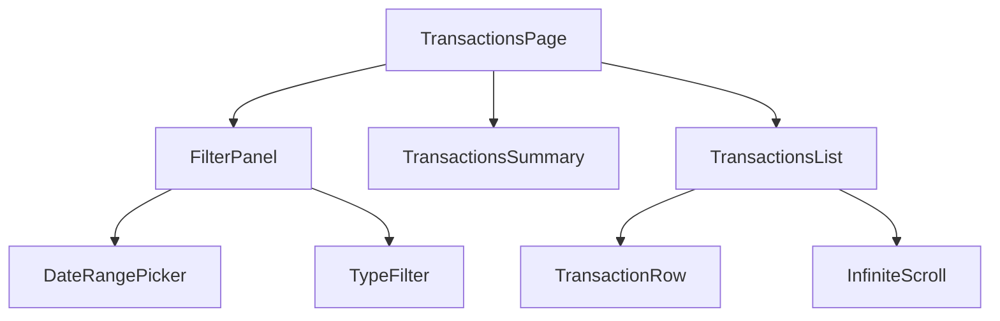

# Transactions View Implementation Status

## Overview
Implementation of a comprehensive transactions view with infinite scroll, filtering capabilities, and transaction management features.

## Technical Decisions

### Backend Changes
- [x] Modify transactions endpoint (GET /transactions) to support:
  - [x] Pagination (skip/limit)
  - [x] Consistent sorting by date (descending)
  - [x] Optional account filtering
  - [x] Response format with hasMore flag

### Frontend Structure

#### Component Hierarchy


#### Components to Implement
1. [x] TransactionsPage (Container)
   - [x] Manages global state
   - [x] Handles API calls
   - [x] Coordinates between components

2. [x] FilterPanel
   - [x] DateRangePicker (default: last 30 days)
   - [x] TypeFilter (All/Expense/Income/Transfer)
   - [x] CategoryFilter
   - [x] Search by description

3. [x] TransactionsList
   - [x] Infinite scroll implementation
   - [ ] Virtual scrolling for performance
   - [x] Loading states
   - [x] Empty states
   - [x] Error handling

4. [x] TransactionRow
   - [x] Display transaction details
   - [x] Category assignment
   - [ ] Expandable for more details
   - [ ] Status indicators

5. [ ] TransactionsSummary
   - [ ] Total Income
   - [ ] Total Expenses
   - [ ] Net Change
   - [ ] Category breakdown

### TypeScript Interfaces

```typescript
interface Transaction {
  _id: string;
  amount: number;
  currency: string;
  date: string;
  description: string;
  type: 'Expense' | 'Income' | 'Transfer';
  category?: Category;
  subCategory?: SubCategory;
  status: 'pending' | 'processed' | 'error';
}

interface TransactionListResponse {
  transactions: Transaction[];
  total: number;
  hasMore: boolean;
}

interface TransactionFilters {
  startDate: Date;
  endDate: Date;
  type?: 'Expense' | 'Income' | 'Transfer';
  category?: string;
  search?: string;
}
```

### API Integration
- [x] Add transactions API service
  - [x] Fetch transactions with pagination
  - [x] Apply filters
  - [x] Update categories
  - [x] Error handling

### UI/UX Features
- [x] Responsive design
- [x] Loading states
- [x] Error states
- [x] Empty states
- [ ] Optimistic updates
- [ ] Sort indicators
- [x] Filter indicators

## Implementation Steps

### Phase 1: Basic Structure
1. [x] Create TransactionsPage component
2. [x] Set up routing
3. [x] Add basic layout
4. [x] Implement API service

### Phase 2: Core Functionality
1. [x] Implement TransactionsList with infinite scroll
2. [x] Add TransactionRow component
3. [x] Add basic filtering
4. [x] Implement transaction loading

### Phase 3: Features & Polish
1. [ ] Add TransactionsSummary
2. [x] Complete FilterPanel implementation
3. [x] Add category management
4. [x] Implement search functionality

### Phase 4: Optimization & Testing
1. [ ] Add virtual scrolling
2. [ ] Optimize performance
3. [ ] Add error boundaries
4. [ ] Implement comprehensive tests

## Testing Plan

### Unit Tests
- [ ] Transaction service functions
- [ ] Component rendering
- [ ] Filter logic
- [ ] Date handling

### Integration Tests
- [ ] API integration
- [ ] Filter interactions
- [ ] Infinite scroll behavior
- [ ] Category updates

### E2E Tests
- [x] Set up test infrastructure:
  * Created frontend/cypress/tasks/db.js for MongoDB operations
  * Implemented test data generation matching backend schema
  * Added transaction creation utilities
  
- [ ] Test Configuration (In Progress):
  * Add MongoDB connectivity to Cypress config
  * Add mongodb dependency to package.json
  * Update assertions to work with real data

- [ ] Test Coverage:
  * Complete transaction flow
  * Filter and search functionality
  * Category assignment
  * Infinite scroll behavior
  * Date range filtering
  * Transaction type filtering

## Progress

### Completed
- Initial planning and architecture design
- Component hierarchy definition
- Basic TypeScript interface definitions:
  * Created transaction.ts with core interfaces
  * Created category.ts for categorization types
- Initial structure setup:
  * Created TransactionsPage component
  * Added route to App.tsx
- API Service Organization:
  * Split API services into separate modules (auth, bank, transactions)
  * Created base api.ts for shared configuration
  * Reorganized services directory structure:
    - Created api/ subdirectory for all API-related code
    - Moved all API files under api/
    - Created types/ subdirectory for shared types
    - Centralized type definitions in api/types/
    - Added clean exports through index.ts files
  * Updated all components to use new import paths
  * Improved code organization and maintainability
- Core Transaction Components:
  * TransactionsList with infinite scroll implementation
  * TransactionRow with currency/date formatting
  * Basic transaction filtering structure
  * Initial filters state management
- FilterPanel implementation:
  * Added date range picker with MUI Date Pickers
  * Added transaction type filter
  * Added search functionality with clear option
  * Added responsive layout
  * Added category filter with loading states
  * Added filter persistence with localStorage
  * Added reset filters functionality
- Performance optimizations:
  * Added debounced search input
  * Added filter persistence with localStorage
  * Implemented category sorting
  * Added loading states for async operations
  * Added performance monitoring and metrics
  * Implemented operation timing tracking
  * Added render time measurements
  * Added real-time performance visualization
  * Created dev-mode performance monitor UI
  * Added performance metrics dashboard
  * Implemented component memoization
  * Added custom memo equality checks
  * Added performance analyzer tools
  * Added development metrics dashboard
  * Added operation cancellation system
  * Implemented automatic cleanup of stale operations
  * Added performance metrics cleanup on unmount
  * Implemented AbortController for async operations
- Keyboard and UX improvements:
  * Added keyboard shortcuts (Ctrl+F, Ctrl+R, Alt+T)
  * Added tooltips for keyboard shortcuts
  * Improved focus management
  * Added visual feedback for actions
- Accessibility improvements:
  * Added ARIA labels and roles
  * Added semantic HTML structure
  * Added descriptive labels for all controls
  * Improved screen reader support
  * Added live region announcements for filter changes
  * Created reusable LiveAnnouncer component
  * Added filter state announcements
  * Implemented keyboard-accessible category quick-search

### In Progress

#### E2E Testing Infrastructure (as of 2025-06-29)
1. ✓ Created MongoDB test utilities
   * Implemented frontend/cypress/tasks/db.js
   * Added transaction generation matching backend schema
   * Set up proper date handling for filters
2. → Setting up test environment
   * Need to update Cypress configuration for MongoDB
   * Need to add mongodb dependency
   * Need to update test assertions for real data
3. → Next steps
   * Test with real MongoDB database
   * Verify date range filtering
   * Test pagination behavior

- FilterPanel enhancements:
  * Test on large datasets
  * Add telemetry integration
  * Optimize component rendering
- Date picker integration:
  * Configured date-fns v4.x integration
  * Set up Hebrew locale support
  * Fixed ESM/CJS compatibility issues
- Transaction system improvements:
  * Removed account-specific endpoint requirement
  * Added optional account filtering
  * Updated API service for flexible queries
  * Simplified component interface
- E2E Testing Infrastructure:
  * Created Cypress task for MongoDB operations
  * Set up test data generation for transactions
  * Implemented database utilities for E2E tests
  * Next: Add MongoDB connectivity to Cypress config
  * Next: Add required dependencies to package.json
  * Next: Update test assertions to match real data


### Next Steps
1. Implement backend pagination support
2. Add TransactionsSummary component with income/expense totals
3. Add virtual scrolling to TransactionsList for better performance
4. Add expandable details to TransactionRow
5. Add status indicators to TransactionRow
6. Complete remaining optimization tasks:
   * Error boundaries
   * Test coverage
   * Sort indicators
   * Optimistic updates

## Notes
- Infinite scroll implementation will show latest transactions at the top
- Using Material-UI components for consistent styling
- Implementing client-side caching for better performance
- Focus on mobile-responsive design
- E2E tests use real MongoDB database with test data

## Current Task (2025-06-29)

Working on E2E test infrastructure:

1. ✓ Created frontend/cypress/tasks/db.js with MongoDB operations
2. ✓ Implemented test data generation matching backend schema
3. → Next: Update Cypress configuration for MongoDB connectivity
4. → Next: Add mongodb dependencies to frontend/package.json
5. → Next: Update test assertions to work with real data
